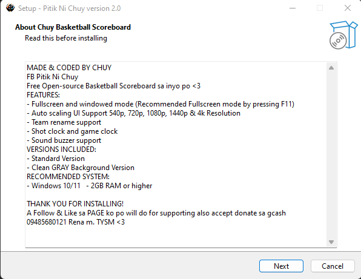
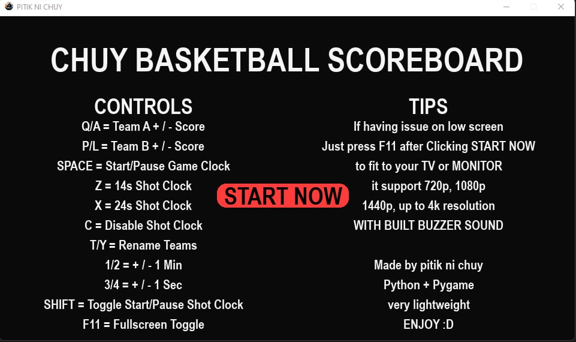
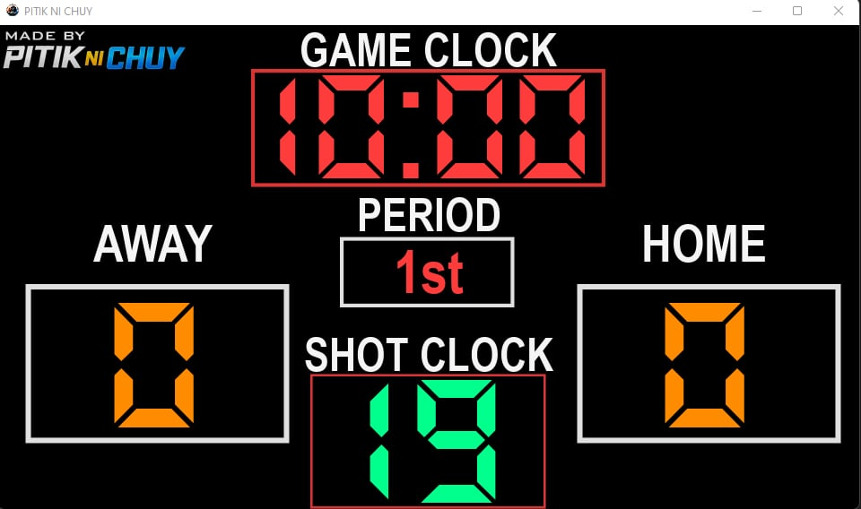
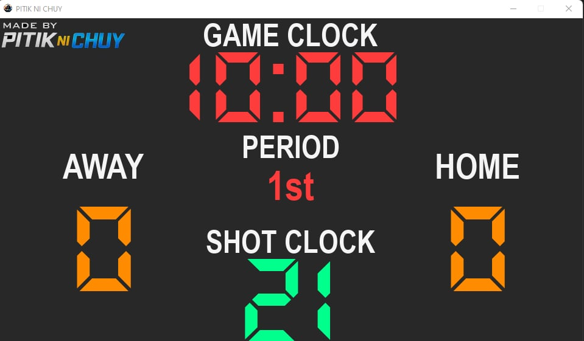

# chuy-open-source-basketball-scoreboard
standard/simplied Basketball Scoreboard

Version v2.0 EXE/Installer

DOWNLOAD LINK / IF NOT WORKING GO TO Releases tab

https://github.com/chuyyy16/chuy-open-source-basketball-scoreboard/releases/download/EXE/Setup64x_ChuyBasketball.exe

This Release is made and coded on Python & Pygame Engine so much more lightweight to run sa mga older laptops, 
my older version was made on java script based also gagamit nang browser mode, so yung old na version ko is medyo
mabigat i run since java based tapos readable lang siya as chromium browser mode (speaking of MEMORY HUNGRY xD)

## How to Use
1. Download installer
2. Install VC++ (auto included)
3. Run app
4. Press START NOW
5. Press F11 for fullscreen

RIGHT NOW eto nayung final Release 64bit na siya then may kasamang VC_Runtime2015-2025.exe nadin,
and Installer nasiya, im planning sana to build a 32bit but mostly devices na windows10/11 is 64bit na lahat e so
64bit nalang ginawa ko (im not sure if windows7/8.1 64bit gagana ba siya kasi sa windows 10 ako nag test neto)

eto yung after installing may MENU siya for GUIDE CONTROLS KEYBOARD also a TIPS tapos may START NOW
para papasok na siya sa MAIN UI of Scoreboard, also sa loob neto after installing may dalawang exe file lalabas
sa desktop may PITIKNICHUY.exe at PITIKNICHUY CleanBG.exe so may kasamang GRAY COLORED BG ONLY SIYA

